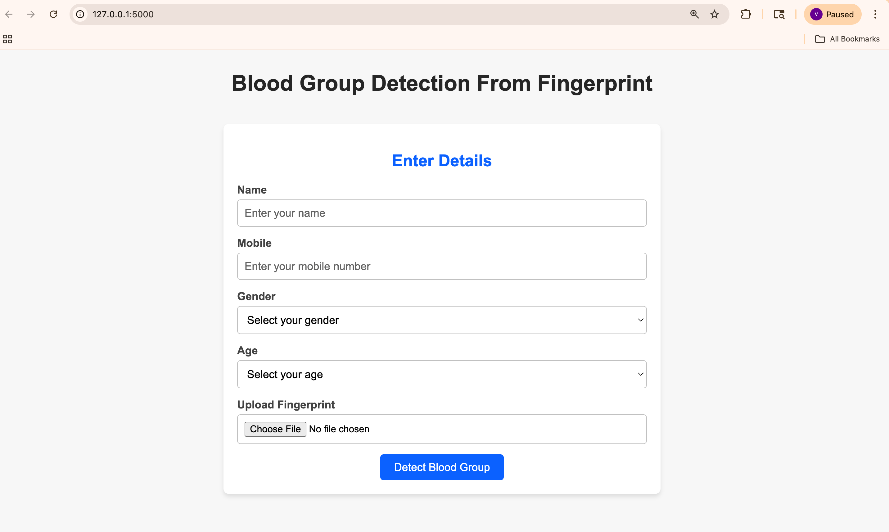
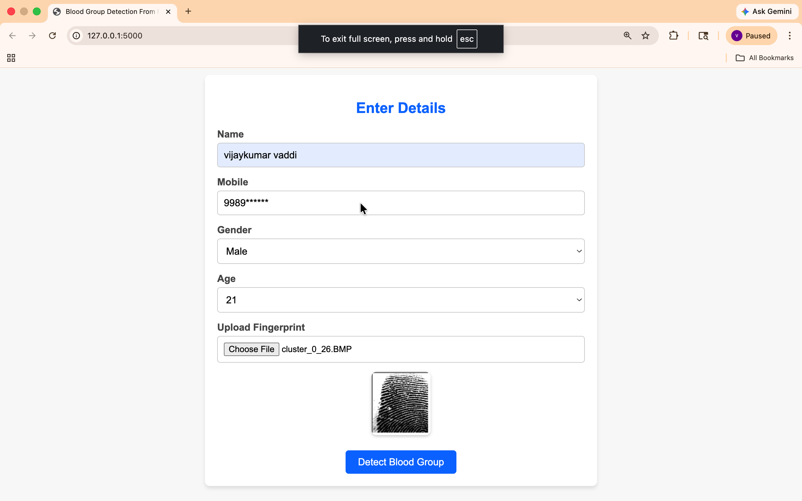
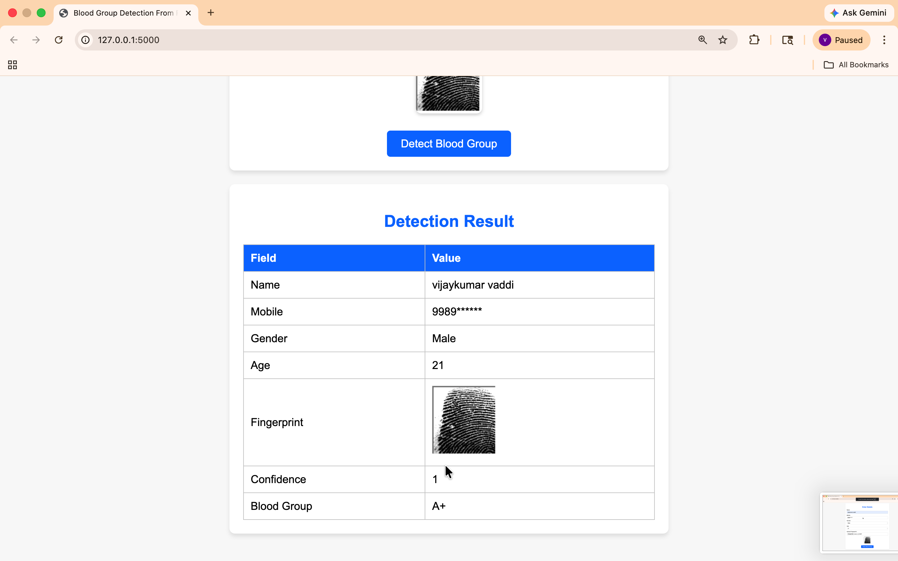
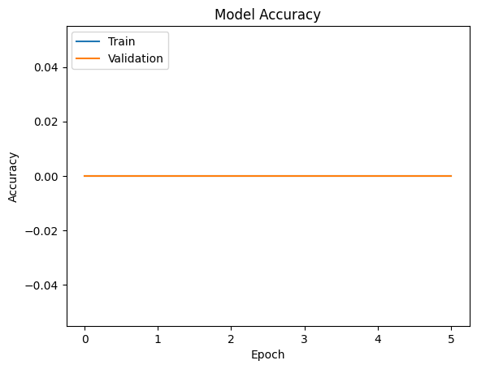
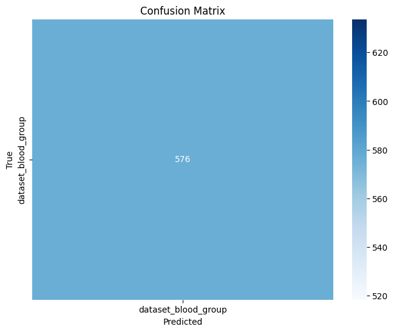

# 🩸 Blood Group Detection using Fingerprint

## 📌 Overview
A deep learning-based web application that predicts blood groups from fingerprint images using a CNN model, deployed with Flask for real-time classification.

## 🚀 Features
- Upload fingerprint image
- Predict blood group
- Supports 8 classes (A+, A-, B+, B-, AB+, AB-, O+, O-)

## 🛠️ Tech Stack
- Python
- TensorFlow / Keras
- Flask
- OpenCV

## 📸 Screenshots

### 🏠 Home Page

### 📤 Input

### 🔍 Result

### 📊 Accuracy

### 📉 Confusion Matrix

